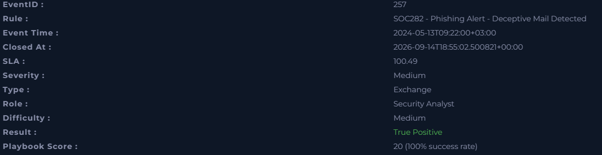
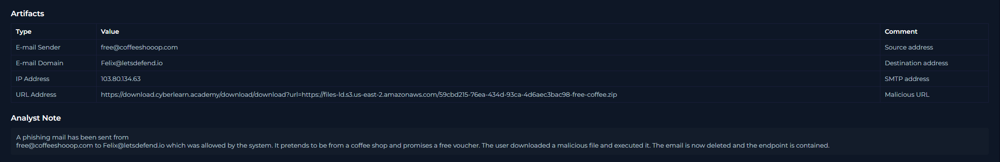
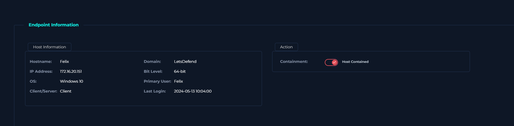

# SOC282 – Phishing Alert: Deceptive Mail Detected

## Overview

The alert was triggered for a suspicious email with the subject **“Free Coffee Voucher”**. The email had been delivered to the user and contained a link to a ZIP file.

My goal was to determine whether the email was malicious, whether the user interacted with it, and what containment action was required.

---

## Alert Details

- **Alert:** SOC282 – Phishing Alert – Deceptive Mail Detected
- **Severity:** Medium
- **Type:** Exchange
- **Result:** True Positive
- **Sender:** free@coffeeshooop.com
- **Recipient:** Felix@letsdefend.io
- **Subject:** Free Coffee Voucher
- **Source IP:** 103.80.134.63
- **Device Action:** Allowed

---

## Investigation

I started by reviewing the email details and checking whether the message had actually been delivered to the user.

The email was successfully delivered, which meant I needed to check whether the user had interacted with the content.

The message contained the following URL:

`hxxps://files-ld[.]s3[.]us-east-2[.]amazonaws[.]com/free-coffee[.]zip`

The linked file was:

`Free_coffee[.]zip`

After analysing the URL/file using the available threat intelligence tools, the file was identified as malicious.

I then checked the endpoint activity to see whether the user had only received the email or had actually interacted with it.

The logs showed that the user:

1. Opened the malicious URL
2. Downloaded the ZIP file
3. Executed the malicious file

At this point, the alert could be confirmed as a **True Positive**, because the malicious content had not only reached the user but had also been executed.

---

## Response

Because the malicious file had been executed, containment was required.

I took the following actions:

- Deleted the phishing email from the recipient’s mailbox
- Contained the affected endpoint
- Classified the alert as a True Positive

Containing the endpoint was important because execution had already occurred, which meant there was a risk of further malicious activity on the system.

---

## MITRE ATT&CK Mapping

The alert was mapped to the following techniques:

- **T1566 – Phishing**
- **T1566.002 – Spearphishing Link**
- **T1059 – Command and Scripting Interpreter**
- **T1204 – User Execution**

These techniques matched the sequence of the attack: phishing delivery, user interaction, and execution of malicious content.

---

## What I Learned

The main thing I took away from this investigation was that identifying a phishing email is only the first part of the process.

The more important question is whether the user actually interacted with it.

In this case, checking the endpoint activity changed the investigation from a suspicious email alert into a confirmed security incident because the malicious file had already been downloaded and executed.

It also helped me understand the importance of following the investigation in sequence:

**email delivery → user interaction → file analysis → endpoint activity → containment**

This was also useful practice in mapping observed behaviour to MITRE ATT&CK techniques rather than treating the alert as an isolated event.

---

## Skills Practised

- Phishing analysis
- SIEM alert investigation
- URL and file analysis
- Endpoint activity review
- Incident classification
- MITRE ATT&CK mapping
- Containment
- Incident documentation

---

## Lab Information

- **Platform:** LetsDefend
- **Role:** Security Analyst
- **Difficulty:** Medium
- **Outcome:** True Positive
- **Playbook Score:** 20/20

> This investigation was completed in a simulated LetsDefend training environment.
